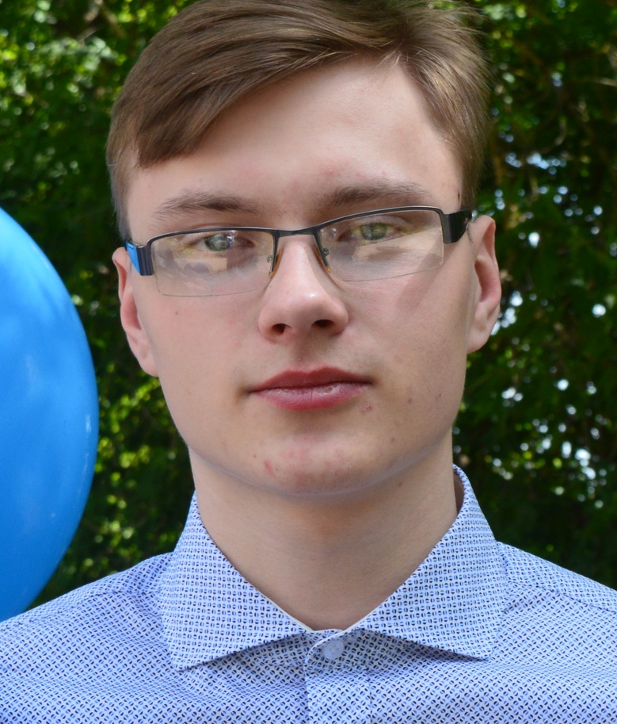

# **Volodkevich Sergey** 

### Contacts

* Discord - Sergey (@sergey-opc)   
* VK - volodkevichs
* Gmail - volodkevich777gmail.com
### Abbout Me

I'm truing to becoom a programmer, because from an early age I considered it a cool profession, and it so happened that I still think so.
I am inquisitive and assiduous, stress-resistant and not a conflict person.
My first job was a school, after that I got a job in the education department for the vacancy "Assistant to the chief system administrator", after about a year I got a job at a cheese factory, and now I also work at a factory, for the production of flour products only, as a system administrator.

### Skills

* Development softwear: Visual Studio,
VSCode, Github
* Languages: C#, C++, JavaScript
* Web-technologies: HTML, CSS
* Databases: MySQL
* OS: Windows